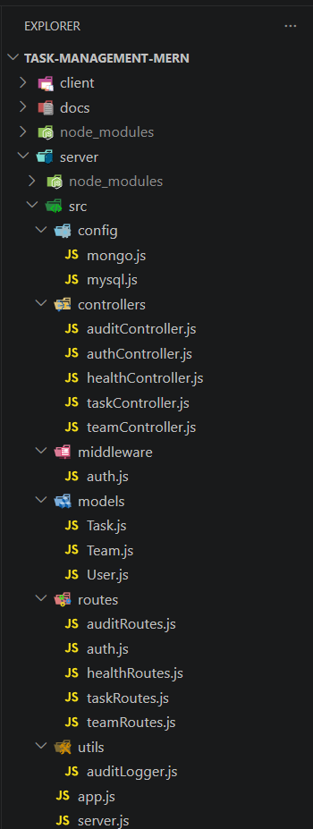
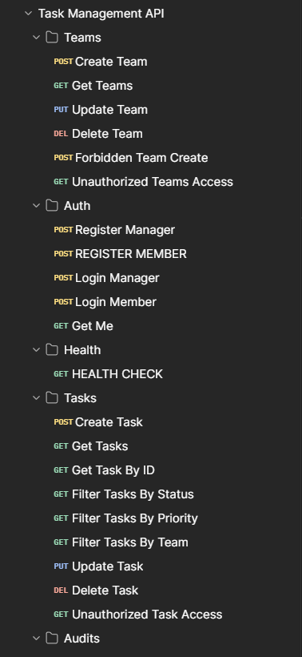
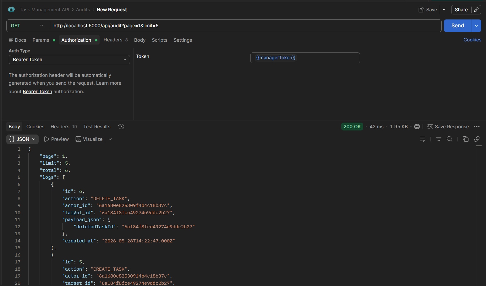
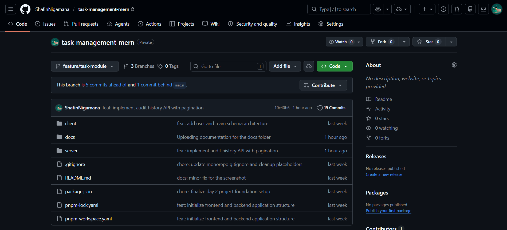

# Task Management MERN

## Project Overview

This project is a team task management platform being developed using the MERN stack.

Current backend implementation includes:

- JWT authentication
- Team management
- Task management
- Audit logging
- MongoDB + MySQL integration

---

## Tech Stack

Backend:

- Node.js
- Express.js
- MongoDB Atlas
- MySQL
- JWT
- Mongoose

Frontend:

- React
- Vite

Tools:

- Postman
- Git
- GitHub

---

## System Architecture

```text
React Frontend
↓
Express Backend
↓
MongoDB (Operational Data)
+
MySQL (Audit Logs)
```

The dual database approach isolates operational data inside scalable document storage (MongoDB), while critical historical interactions are streamed robustly to a local SQL structure (MySQL) for relational querying and strict data preservation.

---

## Features Implemented

### Authentication

- User registration
- User login
- JWT authentication
- Protected routes

### Team Management

- Team CRUD APIs
- Role-based access control

### Task Management

- Task CRUD APIs
- Task assignment
- Task filtering

### Audit Logging

- CREATE_TASK logging
- UPDATE_TASK logging
- DELETE_TASK logging
- Audit history API
- Pagination

---

## API Modules

### Auth Module

- Register
- Login
- Current User

### Team Module

- Create Team
- View Teams
- Update Team
- Delete Team

### Task Module

- Create Task
- View Tasks
- Update Task
- Delete Task
- Task Filters

### Audit Module

- Audit History
- Pagination

---

## Project Structure

```text
task-management-mern/
├── client/
├── server/
│   ├── src/
│   │   ├── config/
│   │   ├── controllers/
│   │   ├── middleware/
│   │   ├── models/
│   │   ├── routes/
│   │   └── utils/
├── docs/
└── README.md
```

---

## Development Progress

| Milestone            | Status    |
| -------------------- | --------- |
| Project Setup        | Completed |
| Database Integration | Completed |
| JWT Authentication   | Completed |
| Team Management      | Completed |
| Task Management      | Completed |
| Audit Logging        | Completed |
| Audit API            | Completed |

---

## Screenshots

### Project Structure



### API Testing Collection



### Audit API Verification



### GitHub Repository



---

## Current Status

Week 2 backend milestone completed successfully.

Implemented:

- Authentication
- Team Management
- Task Management
- Task Filters
- Audit Logging
- Audit History API

Next Phase:

- Frontend routing
- Authentication UI
- Dashboard development
- React integration
