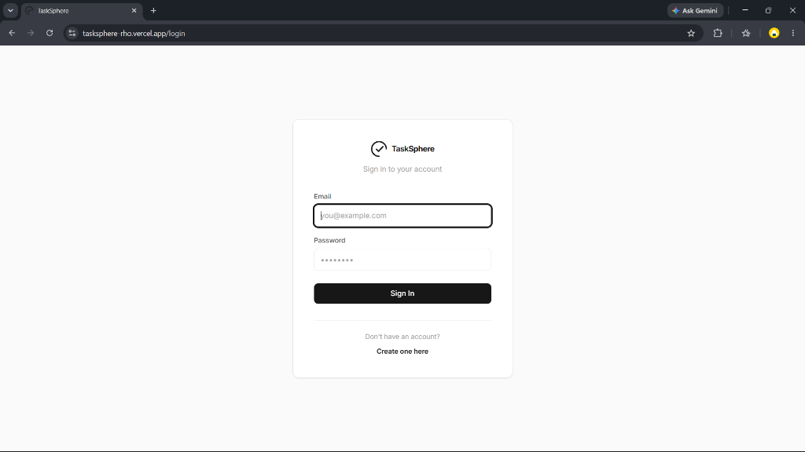
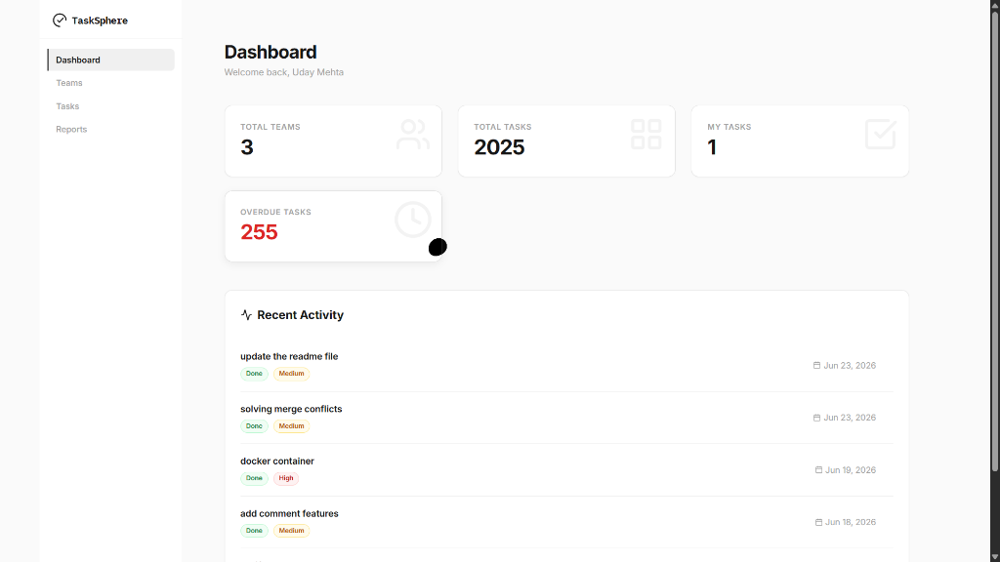
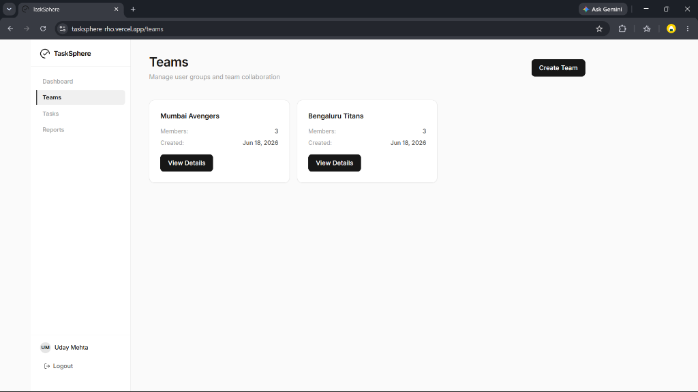
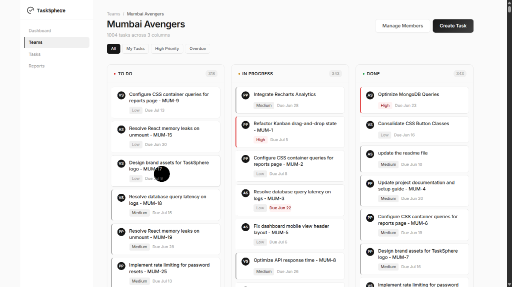
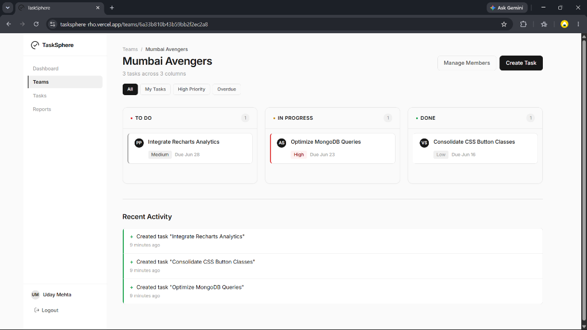
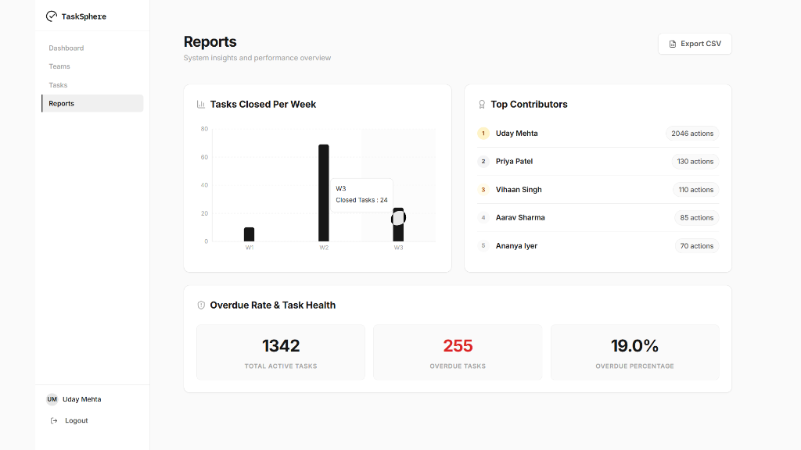
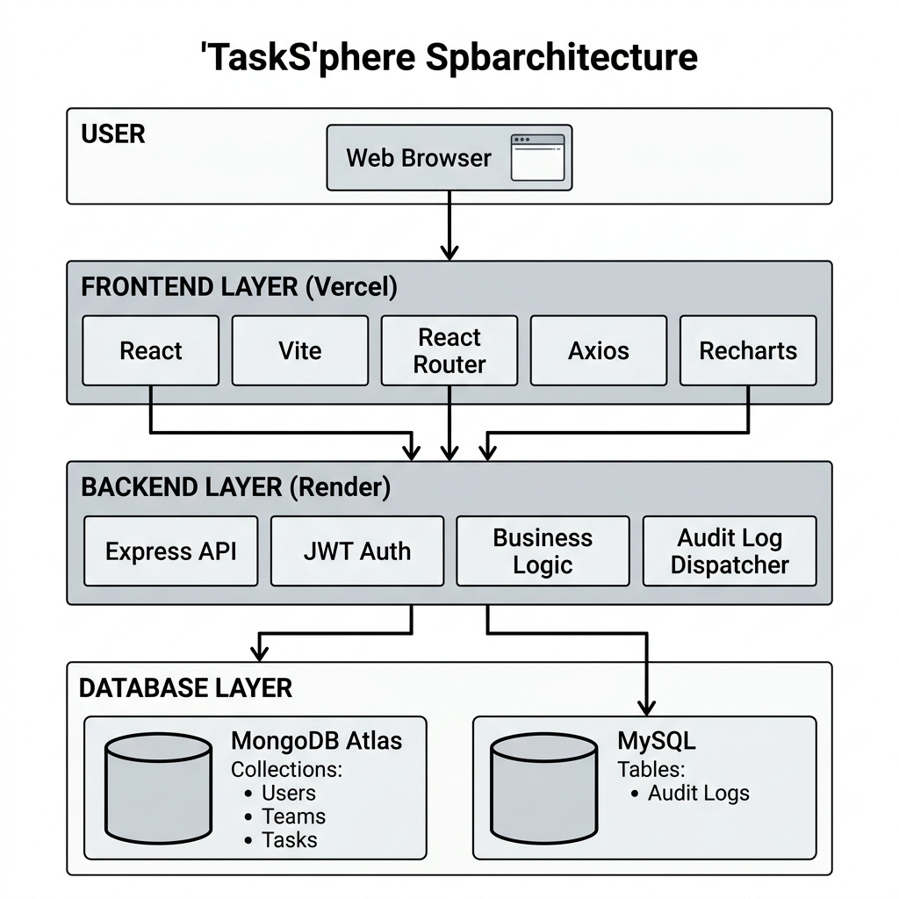

<div align="center">

# TaskSphere 🚀

**A Team Collaboration & Task Management Platform**

*A sleek, premium full-stack team collaboration and task management dashboard designed to replicate high-end SaaS workflows (inspired by Vercel, Linear, and Notion).*

***

[](https://react.dev)
[](https://vite.dev)
[](https://nodejs.org)
[](https://expressjs.com)
[](https://mongodb.com)
[](https://mysql.com)
[](https://vercel.com)
[](https://render.com)
[](./LICENSE)

***

### 🔗 Live Demo

**Frontend Application**: [tasksphere-rho.vercel.app](https://tasksphere-rho.vercel.app)  
**Backend REST API**: [task-management-api-rm0v.onrender.com](https://task-management-api-rm0v.onrender.com)

</div>

---

## 📸 Screenshots

### 1. Modern Login Interface

*Clean, central card auth layout with complete password visibility toggling, error alerts, and manager/member onboarding.*

### 2. Information-Rich Dashboard

*Interactive welcome header greeting, 4-card metric grid (Total Teams, Total Tasks, My Tasks, Overdue count), and click-navigable recent tasks list.*

### 3. Collaboration Teams Directory

*Responsive grid featuring team card summaries (members, created dates, role-scoped details), manager modals, and debounced user searches.*

### 4. Interactive Kanban Board

*Drag-and-drop workspace using `@dnd-kit` with column status indicators (To Do, In Progress, Done), left priority status border strips, and snap-scrolling on mobile viewports.*

### 5. Create Task Interface

*Central task creation modal supporting fields for title, description, assignee, status, priority, and due date.*

### 6. Analytics Reports Dashboard

*Manager-only analytics metrics featuring Recharts weekly task performance, contributor leaderboards, active/overdue ratios, and scoped CSV exports.*

---

## ✨ Features

| Category | Feature | Description |
| :--- | :--- | :--- |
| **Authentication** | Secure JWT | Token-based sessions with local storage credentials caching. |
| | Password Hashing | Secure one-way bcrypt password encryption. |
| | Rate Limiting | IP limiters guarding auth registers and log-in routes. |
| **Team Management**| Create / Roster | Managers can create teams and add members via email search. |
| | Role-Based Access| Granular Manager vs. Member permissions layout. |
| | Roster Updates | Dynamic member search autocomplete with debouncing. |
| **Task Management**| Kanban Board | Full drag-and-drop workflow updates with optimistic UI rollback. |
| | Priority Coding | Task prioritization using color strips (High: Red, Medium: Gray). |
| | Overdue Badging | Urgent red flags highlighting past-due tasks. |
| | Details Modal | Escape-closable details overlay with full editing capability. |
| **Analytics & Logs**| Reports Board | Weekly closed task charts (Recharts) and contributors lists. |
| | CSV Export | Export scoped team performance data directly to CSV. |
| | Live Activity Feed| Action audit logs polling every 5s with custom type indicator borders. |
| **UX & Polish** | Monochrome Aesthetic| Notion/Linear-inspired palette (Black, White, Gray, Inter Font). |
| | Responsive Layout| Sidebar navigation hiding duplication; top horizontal tabs on mobile. |
| | Skeleton Loaders | Pulsing gray shimmer states replacing boring "Loading..." text. |

---

## 🛠️ Tech Stack

<div align="center">

### Frontend
**React (v19.2)** • **Vite (v8.0)** • **React Router (v7.1)** • **Axios (v1.16)** • **@dnd-kit** • **Recharts (v3.8)**

### Backend
**Node.js (v22.x)** • **Express (v5.2)** • **JWT & bcrypt** • **Helmet** • **CORS** • **express-rate-limit** • **Morgan**

### Database
**MongoDB Atlas** (Primary Operational Store) • **Clever Cloud MySQL** (Audit Logs & Analytics)

### Tools & Deployment
**Vercel** (Client Hosting) • **Render** (API Hosting) • **pnpm Workspaces** (Monorepo)

</div>

---

## Architecture Overview

TaskSphere uses a hybrid database design separating operational states (NoSQL) from audit logging history (Relational SQL):

<div align="center">



</div>

---

## 📁 Folder Structure

TaskSphere is structured as a pnpm monorepo layout:

```text
task-management-mern/
├── client/                     # React Frontend Source Code
│   ├── public/                 # Static assets, icons, and favicon.svg
│   └── src/
│       ├── components/         # Reusable widgets (Skeletons, EmptyState, Logo)
│       ├── context/            # AuthContext provider
│       ├── layouts/            # Layout shell templates (MainLayout)
│       ├── pages/              # Page view components (Dashboard, Teams, Reports)
│       ├── services/           # Axios backend api connectors
│       ├── styles/             # Global CSS style systems
│       └── main.jsx
├── server/                     # Express Backend Source Code
│   └── src/
│       ├── config/             # DB settings (Mongo connection, MySQL pool)
│       ├── controllers/        # Route controllers
│       ├── middleware/         # Auth verify, RBAC, and rate limiters
│       ├── models/             # Mongoose schemas (User, Team, Task)
│       ├── routes/             # REST endpoints (auth, teams, tasks, reports)
│       └── app.js
├── docs/                       # Project documentation
├── package.json                # Monorepo pnpm workspaces definition
└── pnpm-workspace.yaml
```

---

## 🚀 Getting Started

### Prerequisites
* [Node.js](https://nodejs.org) (v22.x or later recommended)
* [pnpm](https://pnpm.io) (v10.x recommended)
* MongoDB Atlas Database connection URI
* MySQL Database credentials (with logs schema privileges)

### Installation
Clone the repository and install dependencies from the root directory:
```bash
git clone https://github.com/ShafinNigamana/task-management-mern.git
cd task-management-mern
pnpm install
```

### Environment Variables Setup

Create your environment configuration files:

#### Backend Setup (`server/.env`)
Create a `.env` file inside the `server/` directory:
```env
PORT=5000
JWT_SECRET=your_jwt_signing_secret_key
MONGO_URI=mongodb+srv://<username>:<password>@cluster.mongodb.net/tasksphere
MYSQL_HOST=your_mysql_host_address
MYSQL_PORT=3306
MYSQL_USER=your_mysql_username
MYSQL_PASSWORD=your_mysql_password
MYSQL_DATABASE=your_mysql_database_name
```

#### Frontend Setup (`client/.env`)
Create a `.env` file inside the `client/` directory:
```env
VITE_API_BASE_URL=http://localhost:5000/api
```

### Running Locally
You can launch both the backend server and client server concurrently from the root directory using pnpm:

```bash
# Run both frontend and backend dev servers concurrently
pnpm run dev:client & pnpm run dev:server
```

* **Frontend Client**: [http://localhost:5173](http://localhost:5173)
* **Backend API server**: [http://localhost:5000](http://localhost:5000)

---

## 🔑 Environment Variables Reference

### Frontend Configuration
| Variable | Description | Default / Example |
| :--- | :--- | :--- |
| `VITE_API_BASE_URL` | Base endpoint route prefix for API requests. | `http://localhost:5000/api` |

### Backend Configuration
| Variable | Description | Default / Example |
| :--- | :--- | :--- |
| `PORT` | Listening server port. | `5000` |
| `JWT_SECRET` | Secret key used to sign JSON Web Tokens. | `super_secret_jwt_sign_key` |
| `MONGO_URI` | Mongo DB Atlas connection string. | `mongodb+srv://...` |
| `MYSQL_HOST` | MySQL hostname address. | `127.0.0.1` |
| `MYSQL_PORT` | MySQL connection port. | `3306` |
| `MYSQL_USER` | MySQL database connection user name. | `root` |
| `MYSQL_PASSWORD` | MySQL connection password credential. | `password` |
| `MYSQL_DATABASE` | MySQL database schema name. | `tasksphere_logs` |

---

## 📡 API Overview

All backend endpoints are prefixed with `/api` and protected by JWT auth (unless stated otherwise):

### Authentication (`/api/auth`)
| Method | Endpoint | Description | Access |
| :--- | :--- | :--- | :--- |
| `POST` | `/register` | Register a new user profile. | Public |
| `POST` | `/login` | Log in and receive a session JWT. | Public (Rate Limited) |
| `GET` | `/me` | Retrieve the authenticated user profile. | User JWT |

### Teams (`/api/teams`)
| Method | Endpoint | Description | Access |
| :--- | :--- | :--- | :--- |
| `GET` | `/` | Fetch all teams the user is part of. | User JWT |
| `POST` | `/` | Create a new team roster. | Managers Only |
| `PUT` | `/:id` | Update team roster and members. | Managers Only |
| `DELETE` | `/:id` | Delete an existing team. | Managers Only |

### Tasks (`/api/tasks`)
| Method | Endpoint | Description | Access |
| :--- | :--- | :--- | :--- |
| `GET` | `/` | List all tasks within user's teams. | User JWT |
| `POST` | `/` | Add a new task card. | Team Members |
| `GET` | `/:id` | Fetch task details. | Team Members |
| `PUT` | `/:id` | Update task title, status, or assignee. | Team Members |
| `DELETE` | `/:id` | Delete a task card. | Managers Only |

### Analytics & Logging (`/api/reports` & `/api/audit`)
| Method | Endpoint | Description | Access |
| :--- | :--- | :--- | :--- |
| `GET` | `/reports/metrics`| Retrieve overview metrics & charts. | Managers Only |
| `GET` | `/reports/export` | Download metrics as structured CSV. | Managers Only |
| `GET` | `/audit` | Fetch paginated team activity logs. | Team Members |

---

## 👥 User Roles & Permissions

TaskSphere implements role-based access control (RBAC):

### Manager
* Create new teams and manage their member rosters.
* Create tasks, edit details, and modify statuses.
* Delete any task card in the workspace.
* Access the **Reports Dashboard** containing team statistics.
* Export team performance reports to CSV files.

### Member
* View teams they have been added to by managers.
* Create, edit, and move task cards on their assigned Kanban boards.
* View team activity logs in the **Recent Activity Feed**.
* **Blocked** from accessing the Reports Dashboard, CSV Export, or deleting task cards.

---

## 🌐 Deployment

### Frontend (Vercel)
Deploy the frontend client folder to Vercel:
1. Link your GitHub repository.
2. Set directory root to `client`.
3. Set Build Command: `node ../patch-es-toolkit.js && vite build`
4. Set Output Directory: `dist`
5. Configure Environment Variables: `VITE_API_BASE_URL`.

### Backend (Render)
Deploy the server folder to Render:
1. Link your GitHub repository.
2. Select Web Service.
3. Set Root Directory to `server`.
4. Set Build Command: `pnpm install`
5. Set Start Command: `node src/server.js`
6. Add environment variables: `PORT`, `JWT_SECRET`, `MONGO_URI`, `MYSQL_HOST`, `MYSQL_PORT`, `MYSQL_USER`, `MYSQL_PASSWORD`, `MYSQL_DATABASE`.

---

## 🗺️ Roadmap

### Version 1.1 (Completed)
* ✓ Sleek, minimal monochrome CSS branding system (Linear style).
* ✓ Pulsing shimmer skeletons and structured SVG empty states.
* ✓ granules scope-based team ownership visibility.
* ✓ Drag rotation enhancements on Kanban cards.
* ✓ Integrated MySQL logging tracking user contributions.

### Version 1.2 (Planned)
* Task sorting & filtering refinements.
* Expandable subtasks checklist.
* Date-picker calendar layouts.

### Version 2.0 (Future)
* Realtime collaborative cursor indicators.
* Slack/Email task deadline triggers.
* Desktop offline synchronization support.

---

## ✍️ Author
**Shafin Nigamana**
* **GitHub**: [@ShafinNigamana](https://github.com/ShafinNigamana)
* **LinkedIn**: [https://linkedin.com/in/shafin-nigamana](https://www.linkedin.com/in/shafin-nigamana/)

---

## 📄 License
This project is licensed under the MIT License - see the [LICENSE](LICENSE) file for details.
