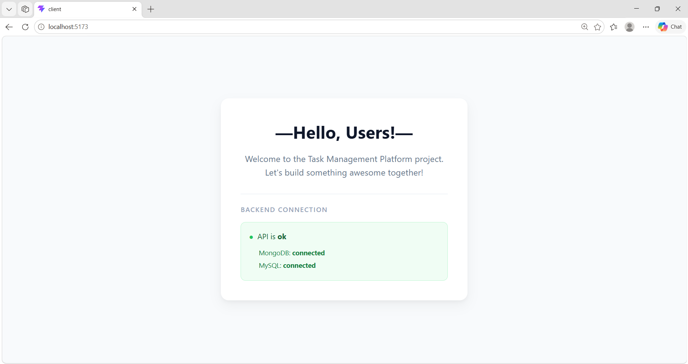

# Team Task Management Platform

Internship project focused on building a team task management platform using the MERN stack.

## Tech Stack

- Frontend: React, Vite
- Backend: Node.js, Express
- Database: MongoDB Atlas, Local MySQL

## Implemented Features

- Monorepo setup (client/server directories)
- Frontend and backend integration
- Dual database connection (MongoDB and MySQL)
- Backend health check endpoint verifying database connectivity

## Repository Structure

- `client/`: React + Vite frontend application
- `server/`: Express backend API
- `docs/`: Project documentation and daily logs

## Health Endpoint

GET `/api/health`
Verifies backend server status and database connections.

```json
{
  "status": "ok",
  "db": {
    "mongo": "connected",
    "mysql": "connected"
  }
}
```

### Health Endpoint Screenshot



## Local Setup

1. Install dependencies from the root directory:

   ```bash
   pnpm install
   ```

2. Configure environment variables:
   Create a `.env` file in the `server/` directory containing your MongoDB Atlas connection string and local MySQL credentials.

3. Start the development servers:
   ```bash
   pnpm dev
   ```
